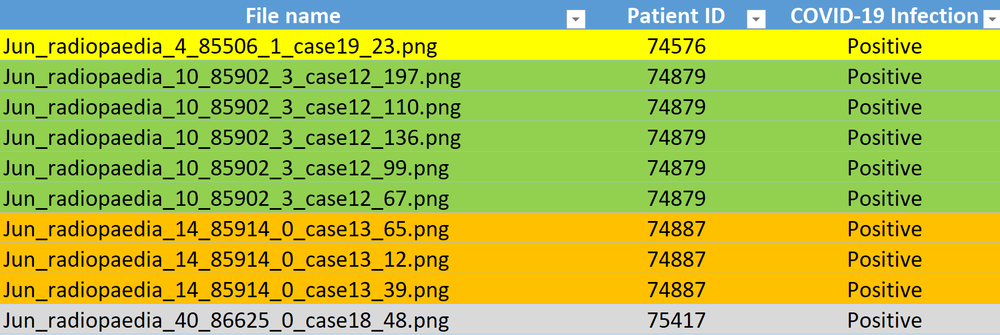

# Patient_Aware_Image_Split
It is important not to split images of the same patient between the test and train sets to avoid overfitting. This repository splits a sample Covid/Normal classification dataset into test and train sets in a patient aware and stratified manner. The meta-data file is used to group the images based on Patient-ID. 

While grouping should be done strictly to ensure there is no overlap of groups, stratification can be done approximately i.e. as well as possible.
This code assumes that all instances of one group have the same stratification category, meaning that all the images coming from the same Patient ID are either Covid or NonCovid.

**split_to_folders.py** splits images into 4 folders inside splitted: train/Covid, train/NonCovid, test/Covid, test/NonCovid\
**split_into_dictionary.py** splits images into a dictionary\
**split_into_dataloader.py** splits images into a torch Dataloader\

